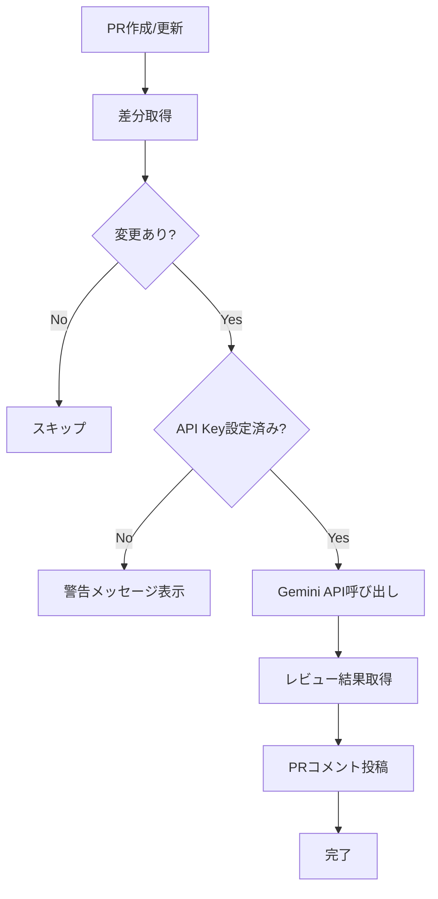

# 🤖 AI レビュー設定ガイド

このガイドでは、Google Gemini APIを使用した自動コードレビュー機能の設定と活用方法について説明します。

## 🎯 AI レビュー機能の概要

### 主な機能

- **自動レビュー**: PRのコード差分を解析してフィードバックを提供
- **技術スタック対応**: Python/JavaScript双方の開発ルールに対応
- **日本語レポート**: わかりやすい日本語でのレビューコメント
- **品質チェック**: コード品質、セキュリティ、パフォーマンスの観点から評価

### レビュー対象

- **Python (`backend/`)**: Ruff・Black設定準拠、依存関係、ベストプラクティス
- **JavaScript/TypeScript (`frontend/`)**: ESLint Flat Config・Prettier準拠、React規約
- **全体**: セキュリティ、パフォーマンス、可読性、潜在的なバグ

## 🔧 セットアップ手順

### 1. Google Gemini API キーの取得

#### Google AI Studio でのAPI キー作成

1. [Google AI Studio](https://makersuite.google.com/) にアクセス
2. Googleアカウントでログイン
3. 「Get API key」をクリック
4. 「Create API key in new project」を選択
5. API キーをコピー

#### API利用制限と料金

| 利用方法 | 月間制限 | 料金 | 備考 |
|---------|---------|------|------|
| **無料枠** | 60 requests/min | 無料 | 個人・小規模チーム向け |
| **有料枠** | カスタム | 従量課金 | 大規模チーム・企業向け |

> 💡 **注意**: 無料枠でも一般的な開発チームには十分です。PR数が多い場合は利用状況を監視してください。

### 2. GitHub Secrets の設定

#### リポジトリでのSecret設定

1. GitHubリポジトリページを開く
2. **Settings** タブに移動
3. 左メニューから **Secrets and variables** → **Actions** を選択
4. **New repository secret** をクリック
5. 以下の情報を入力：
   - **Name**: `GEMINI_API_KEY`
   - **Secret**: 取得したAPI キー
6. **Add secret** をクリック

#### Organization レベルでの設定（オプション）

```yaml
# 複数リポジトリで共有する場合
Organization Settings → Secrets and variables → Actions
→ New organization secret
```

### 3. ワークフロー有効化確認

AIレビューワークフローは既に設定済みです。以下で動作確認：

```bash
# 新しいブランチ作成
git checkout -b feature/test-ai-review

# 簡単な変更を追加
echo "# Test change" >> README.md

# コミット・プッシュ
git add . && git commit -m "test: AI review functionality"
git push -u origin feature/test-ai-review

# GitHub でPR作成
gh pr create --title "Test AI Review" --body "Testing AI review functionality"
```

## 📝 レビュープロンプトの詳細

### 標準プロンプトテンプレート

```
あなたは、このプロジェクトで採用されている以下の技術スタックに精通したエキスパートレビューアです。

- Python: uvによるパッケージ管理, Ruffによるリンティング, Blackによるフォーマット
- JavaScript/TypeScript: Bunによるパッケージ管理, ESLint (Flat Config)によるリンティング, Prettierによるフォーマット, React

これらのルールに基づき、以下のコード変更（diff形式）をレビューしてください。
特に、以下のチェックポイントに注目し、具体的で建設的なフィードバックを日本語で提供してください。

--- チェックポイント ---
1.  **Python (`backend/`):**
    - `pyproject.toml` に定義されたRuffとBlackのルールに準拠していますか？
    - 新しい依存関係は適切に追加されていますか？

2.  **JavaScript/TypeScript (`frontend/`):**
    - `eslint.config.js` (Flat Config) とPrettierのルールに準拠していますか？
    - Bunの利用方法（`package.json`のスクリプトなど）に問題はありませんか？

3.  **全体:**
    - コードの品質、潜在的なバグ、パフォーマンス、セキュリティ、可読性の観点で改善点はありますか？

もし問題がなければ、「指摘事項はありません。素晴らしい変更です！」と簡潔に述べてください。

--- コード差分 ---
{diff_content}
```

### レビューカテゴリ

#### 1. コード品質

```python
# 例: AIが指摘する品質問題
def bad_function():
    # ❌ 関数名が不明確
    # ❌ ドキュメント不足
    # ❌ 型ヒント不足
    data = get_data()
    result = []
    for item in data:
        if item > 0:
            result.append(item * 2)
    return result

def calculate_positive_values_doubled(input_data: list[int]) -> list[int]:
    """正の値のみを2倍にして返す関数
    
    Args:
        input_data: 整数のリスト
        
    Returns:
        正の値を2倍にしたリスト
    """
    return [item * 2 for item in input_data if item > 0]
```

#### 2. セキュリティ

```typescript
// 例: AIが指摘するセキュリティ問題
// ❌ XSS脆弱性
function DisplayUserInput({ userInput }: { userInput: string }) {
  return <div dangerouslySetInnerHTML={{ __html: userInput }} />;
}

// ✅ 安全な実装
function DisplayUserInput({ userInput }: { userInput: string }) {
  return <div>{userInput}</div>; // 自動エスケープ
}

// ❌ 機密情報のログ出力
console.log('User password:', password);

// ✅ 安全なログ出力
logger.info('User login attempt', { userId: user.id });
```

#### 3. パフォーマンス

```typescript
// 例: AIが指摘するパフォーマンス問題
// ❌ 不適切な依存関係
function ExpensiveComponent({ data }: { data: any[] }) {
  const expensiveValue = useMemo(() => {
    return data.reduce((sum, item) => sum + item.value, 0);
  }, []); // 依存関係が不適切
  
  return <div>{expensiveValue}</div>;
}

// ✅ 適切な依存関係
function ExpensiveComponent({ data }: { data: any[] }) {
  const expensiveValue = useMemo(() => {
    return data.reduce((sum, item) => sum + item.value, 0);
  }, [data]); // dataが変更された時のみ再計算
  
  return <div>{expensiveValue}</div>;
}
```

## 🔄 ワークフロー詳細

### レビュー実行フロー



### API呼び出し詳細

```python
# review.py の主要処理
def get_ai_review(diff_content):
    api_key = os.environ.get('GEMINI_API_KEY')
    if not api_key:
        raise ValueError("GEMINI_API_KEY is not set")
    
    # Gemini API endpoint
    url = f"https://generativelanguage.googleapis.com/v1beta/models/gemini-pro:generateContent?key={api_key}"
    
    payload = {
        "contents": [{
            "parts": [{
                "text": prompt
            }]
        }],
        "generationConfig": {
            "temperature": 0.7,     # 創造性レベル
            "topK": 40,            # 候補数制限
            "topP": 0.95,          # 確率分布調整
            "maxOutputTokens": 2048, # 最大出力長
        }
    }
    
    try:
        response = requests.post(url, json=payload, timeout=30)
        response.raise_for_status()
        return extract_response_text(response.json())
    except Exception as e:
        return handle_error(e)
```

### エラーハンドリング

| エラータイプ | 対処方法 | ユーザー表示 |
|-------------|----------|-------------|
| **API Key未設定** | 処理をスキップ | ⚠️ 設定手順メッセージ |
| **タイムアウト** | 再試行提案 | ⏱️ タイムアウトメッセージ |
| **API制限** | 制限情報表示 | 🚫 制限超過メッセージ |
| **ネットワーク** | エラー詳細表示 | ❌ 接続エラーメッセージ |

## ⚙️ カスタマイズ設定

### 1. プロンプトのカスタマイズ

```python
# .github/workflows/review.yml の修正例
custom_prompt = """あなたは{プロジェクト名}の専門レビューアです。

特に以下の点に注意してレビューしてください：
1. {カスタムルール1}
2. {カスタムルール2}
3. {カスタムルール3}

--- 追加チェック項目 ---
- データベース操作の安全性
- API レスポンスのバリデーション
- ログ出力の適切性

{diff_content}
"""
```

### 2. レビュー条件の変更

```yaml
# 特定ファイルのみレビュー対象
- name: Get PR diff
  run: |
    git diff $BASE_SHA..$HEAD_SHA -- '*.py' '*.ts' '*.tsx' > pr_diff.txt

# 特定サイズ以上のPRのみ
- name: Check PR size
  run: |
    CHANGES=$(git diff --numstat $BASE_SHA..$HEAD_SHA | wc -l)
    if [ $CHANGES -lt 10 ]; then
      echo "Skip review for small changes"
      exit 0
    fi
```

### 3. 複数モデルの使用

```python
# 高度な設定: 異なるモデルを使い分け
def get_model_for_changes(diff_content):
    if 'security' in diff_content.lower():
        return 'gemini-pro'  # セキュリティ特化
    elif len(diff_content) > 10000:
        return 'gemini-pro'  # 大規模変更
    else:
        return 'gemini-pro'  # 標準
```

## 📊 レビュー効果の測定

### メトリクス例

```yaml
# レビュー統計の収集
- name: Collect review metrics
  run: |
    echo "PR Size: $(git diff --numstat $BASE_SHA..$HEAD_SHA | wc -l)" >> metrics.txt
    echo "Review Date: $(date)" >> metrics.txt
    echo "Files Changed: $(git diff --name-only $BASE_SHA..$HEAD_SHA | wc -l)" >> metrics.txt
```

### 効果測定指標

| 指標 | 説明 | 目標値 |
|------|------|--------|
| **レビュー応答時間** | AIレビューの実行時間 | < 60秒 |
| **指摘精度** | 有用な指摘の割合 | > 70% |
| **false positive率** | 不適切な指摘の割合 | < 20% |
| **開発者満足度** | チームからのフィードバック | > 4.0/5.0 |

## 🚨 トラブルシューティング

### よくある問題と解決方法

#### 1. API キーエラー

```bash
# 問題: Invalid API key
# 確認方法
curl -H "Content-Type: application/json" \
     -d '{"contents":[{"parts":[{"text":"Hello"}]}]}' \
     "https://generativelanguage.googleapis.com/v1beta/models/gemini-pro:generateContent?key=YOUR_API_KEY"

# 解決方法
# 1. API キーの再生成
# 2. GitHub Secrets の更新
# 3. API有効化確認
```

#### 2. レビューが表示されない

```yaml
# デバッグ用ステップ追加
- name: Debug AI review
  run: |
    echo "GEMINI_API_KEY exists: $([ -n "$GEMINI_API_KEY" ] && echo 'Yes' || echo 'No')"
    echo "PR number: ${{ github.event.pull_request.number }}"
    echo "Repository: ${{ github.repository }}"
    ls -la pr_diff.txt
    head -20 pr_diff.txt
```

#### 3. API制限超過

```python
# レート制限の処理
import time
import random

def api_call_with_retry(payload, max_retries=3):
    for attempt in range(max_retries):
        try:
            response = requests.post(url, json=payload, timeout=30)
            if response.status_code == 429:  # Rate limit
                wait_time = (2 ** attempt) + random.uniform(0, 1)
                time.sleep(wait_time)
                continue
            response.raise_for_status()
            return response
        except Exception as e:
            if attempt == max_retries - 1:
                raise e
    return None
```

## 📈 高度な活用方法

### 1. チーム固有ルールの学習

```python
# プロンプトにチーム規約を追加
team_specific_rules = """
--- チーム固有ルール ---
- 関数名は動詞から始める
- React コンポーネントは PascalCase
- API エンドポイントは RESTful 設計
- エラーハンドリングは必須
- テストカバレッジ 80% 以上
"""
```

### 2. 段階的レビュー

```yaml
# 軽量レビュー（小さな変更）
- name: Quick review
  if: steps.check-size.outputs.lines < 50
  run: python quick_review.py

# 詳細レビュー（大きな変更）  
- name: Detailed review
  if: steps.check-size.outputs.lines >= 50
  run: python detailed_review.py
```

### 3. 学習データの蓄積

```python
# レビュー履歴の保存
def save_review_history(pr_number, diff, review_result):
    history = {
        "pr_number": pr_number,
        "timestamp": datetime.now().isoformat(),
        "diff_size": len(diff),
        "review_result": review_result,
        "files_changed": get_changed_files(diff),
    }
    
    # 履歴ファイルに追記
    with open("review_history.jsonl", "a") as f:
        f.write(json.dumps(history) + "\n")
```

## 📚 参考リンク

### 公式ドキュメント
- [Google Gemini API](https://ai.google.dev/docs)
- [GitHub Actions Secrets](https://docs.github.com/en/actions/reference/encrypted-secrets)
- [Workflow Triggers](https://docs.github.com/en/actions/reference/events-that-trigger-workflows)

### コミュニティリソース
- [AI Code Review Best Practices](https://github.com/features/copilot)
- [Prompt Engineering Guide](https://www.promptingguide.ai/)
- [Code Review Guidelines](https://google.github.io/eng-practices/review/)

---

💡 **運用のコツ**: AIレビューは人間レビューの補完として活用し、チームの学習と品質向上に役立てることが重要です。定期的にレビュー結果を評価し、プロンプトを改善していきましょう。