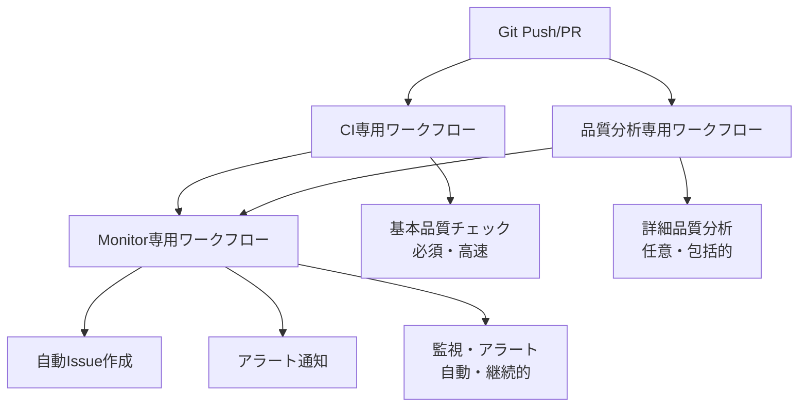

# 🔄 ワークフロー完全分離戦略 (Option B)

## 📋 概要

このプロジェクトでは、関心の分離原則に基づき、GitHub Actionsワークフローを3つの独立したシステムに分離しています。

## 🏗️ アーキテクチャ構成



## 🎯 ワークフロー詳細

### 1. **CI専用ワークフロー** - 基本品質チェック（必須・高速）

#### **Python CI (Improved)**
```yaml
name: Python CI (Improved)
trigger: backend/変更時
実行時間: 2-3分
必須レベル: ★★★ (Branch Protection対象)
```

**責任範囲:**
- ✅ Ruff基本リンティング・フォーマット
- ✅ MyPy型チェック（エラーのみ）
- ✅ Banditセキュリティ基本スキャン
- ✅ pytest基本テスト実行
- ✅ コードカバレッジ測定

**設計原則:**
- **高速実行**: 3分以内完了
- **必須チェックのみ**: マージ要件
- **失敗時即座停止**: 開発フロー阻害回避

#### **JavaScript CI (Improved)**
```yaml
name: JavaScript CI (Improved)  
trigger: frontend/変更時
実行時間: 2-3分
必須レベル: ★★★ (Branch Protection対象)
```

**責任範囲:**
- ✅ ESLint基本ルール
- ✅ Prettier フォーマットチェック
- ✅ TypeScript型チェック（エラーのみ）
- ✅ Vitest基本テスト実行
- ✅ 基本ビルド検証

### 2. **品質分析専用ワークフロー** - 詳細分析・レポート（任意・包括的）

#### **Quality Analysis**
```yaml
name: Quality Analysis
trigger: 週次自動実行 (月曜日 午前2時) + 手動実行
実行時間: 8-10分
必須レベル: ★☆☆ (情報提供のみ)
```

**責任範囲:**
- 📊 **詳細Python分析**:
  - Ruff詳細レポート（統計・HTML）
  - MyPy完全分析（HTML・JSON）
  - Bandit詳細セキュリティ（HTML・JSON）
  - 複雑度分析（radon）
  - 依存関係脆弱性（pip-audit・safety）

- 📊 **詳細JavaScript分析**:
  - ESLint詳細レポート（HTML・JSON）
  - TypeScript詳細分析
  - バンドル分析（サイズ・パフォーマンス）
  - 依存関係脆弱性（bun audit）

- 📊 **品質トレンド分析**:
  - 過去30日間の品質推移
  - メトリクス比較・トレンド検出
  - HTMLダッシュボード生成

**設計原則:**
- **非ブロッキング**: CI失敗でもマージ可能
- **詳細分析**: 開発者向け改善提案
- **長期保存**: 30-90日間レポート保持

### 3. **監視専用ワークフロー** - アラート・Issue作成（自動・継続的）

#### **Quality Monitor**
```yaml
name: Quality Monitor
trigger: 週次自動実行 (日曜日 午前9時) + 手動実行
実行時間: 1-2分
必須レベル: ★★☆ (運用保守)
```

**責任範囲:**
- 🚨 **CI失敗監視**:
  - 失敗ワークフロー検出
  - 自動Issue作成
  - PR作成者への通知

- 🔍 **バイパス使用監視**:
  - `--no-verify`使用頻度追跡
  - 閾値超過時アラート
  - 週次使用状況レポート

- 📈 **品質トレンド監視**:
  - 品質劣化検出
  - 週次品質レポート生成
  - 長期トレンド分析

**設計原則:**
- **自動運用**: 人的介入なしで動作
- **アラート生成**: 問題の早期発見
- **継続監視**: 定期実行による状況把握

## 📊 分離戦略のメリット

### 1. **パフォーマンス最適化**
```
従来: 1つの重いワークフロー (8-10分)
現在: 3つの独立ワークフロー
- CI: 2-3分 (必須・毎PR実行)
- 品質分析: 8-10分 (週次自動実行)
- 監視: 1-2分 (週次自動実行)
```

### 2. **関心の分離**
| ワークフロー | 主要関心事 | 対象ユーザー | 実行頻度 |
|-------------|-----------|-------------|----------|
| **CI** | コード品質・マージ可否 | 開発者 | 毎PR・Push |
| **品質分析** | 詳細改善提案・トレンド | チームリーダー | 週次・手動 |
| **監視** | 運用状況・アラート | DevOps・PM | 週次・手動 |

### 3. **障害影響範囲の限定**
```
CI失敗 → マージブロック（適切）
品質分析失敗 → 情報不足のみ（マージ可能）
監視失敗 → アラート不送信のみ（開発継続可能）
```

### 4. **スケーラビリティ**
- **CI**: 新しい基本チェック追加容易
- **品質分析**: 新しい分析ツール追加容易
- **監視**: 新しいアラート追加容易

## ⚙️ 設定詳細

### Branch Protection Rules
```yaml
required_status_checks:
  - "quality-check"      # Python CI
  - "compatibility-check" # JavaScript CI  
  - "test-matrix"        # CI マトリックス

# 品質分析・監視は必須チェック対象外
# → CI失敗でマージブロック
# → 品質分析失敗でもマージ可能
```

### ワークフロートリガー設定
```yaml
# CI: パス限定で効率実行
on:
  pull_request:
    paths: ['backend/**', 'frontend/**']

# 品質分析: 週次自動実行
on:
  schedule:
    - cron: '0 2 * * 1'  # 毎週月曜日午前2時
  workflow_dispatch:  # 手動実行も可能

# 監視: 週次自動実行
on:
  schedule:
    - cron: '0 9 * * 0'  # 毎週日曜日午前9時
  workflow_dispatch:  # 手動実行も可能
```

## 🛠️ 運用手順

### 開発者向け（日常開発）
1. **コード変更・PR作成**
2. **CI実行確認** (2-3分) - 必須
3. **マージ可否判定** - CI成功でマージ可能

### チームリーダー向け（品質管理）
1. **週次品質レポート確認** (月曜日生成)
2. **品質トレンド分析**
3. **改善提案の優先順位決定**
4. **必要時手動で詳細分析実行**

### DevOps向け（運用監視）
1. **週次監視レポート確認** (日曜日生成)
2. **アラートIssue対応**
3. **バイパス使用状況監視**
4. **必要時手動で詳細監視実行**

## 📈 成功指標

### CI専用ワークフロー
- ✅ **実行時間**: ≤ 3分
- ✅ **成功率**: ≥ 95%
- ✅ **開発者満足度**: ≥ 85%

### 品質分析専用ワークフロー
- ✅ **レポート生成率**: ≥ 98%
- ✅ **改善提案採用率**: ≥ 60%
- ✅ **品質トレンド可視化**: 継続実施

### 監視専用ワークフロー
- ✅ **アラート精度**: ≥ 90%
- ✅ **Issue自動作成率**: ≥ 95%
- ✅ **バイパス使用率**: ≤ 5%/月

## 🔄 継続改善

### 月次レビュー項目
- [ ] 各ワークフローの実行時間・成功率
- [ ] 品質メトリクス推移確認
- [ ] アラート精度・対応状況
- [ ] 開発者フィードバック収集

### 四半期最適化
- [ ] ワークフロー分離効果測定
- [ ] 新規ツール・チェック追加検討
- [ ] チーム要求に基づく機能拡張
- [ ] コスト効率分析・最適化

---

**📞 サポート**: DevOpsチーム  
**📖 関連ドキュメント**: [Pre-commit ガイド](pre-commit-guide.md) | [ワークフロー解説](workflows.md)  
**🎯 導入計画**: [段階的導入計画](../ROLLOUT-PLAN.md)